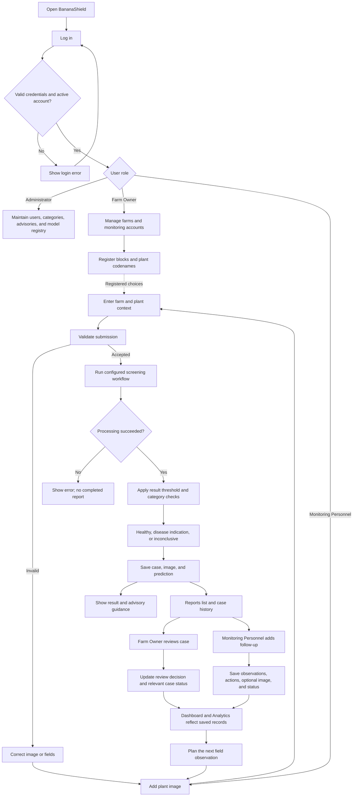

# BananaShield - Full System Flow and Context

This document describes the current implementation reviewed on September 5, 2026. It is a reference for development, demonstrations, and system documentation. Where the intended workflow differs from the code, the difference is identified explicitly.

## 1. System purpose

BananaShield is a browser-based banana-farm screening and record-management system. Monitoring Personnel submit plant images and field context; the system produces a preliminary result and saves a report. Farm Owners manage farms, blocks, plant codenames, and monitoring accounts, review reports, and inspect analytics. System Administrators maintain authorized users, supported categories, advisory content, and model registry settings.

The application supports multiple registered farms within a shared deployment. Its agricultural context includes Davao del Sur and banana varieties such as Cardava, Binangay, and Tundan.

The main operational cycle is:

**Register farms and personnel -> submit screening -> save result and image -> review report -> record follow-ups -> inspect analytics -> continue monitoring.**

Healthy screenings are recorded. A healthy result can serve as a baseline for later observations. Each new screening creates its own report; repeated screenings of the same plant are not automatically merged.

## 2. System boundary and architecture

| Component | Responsibility |
| --- | --- |
| Browser interface | Login, forms, photo selection, report viewing, farm management, and analytics |
| Laravel 12 / PHP 8.2+ | Authentication, permissions, validation, report persistence, search, review, and analytics |
| MySQL or compatible database | Users, farms, blocks, cases, predictions, follow-ups, advisory versions, model registry, and audit logs |
| Private file storage | Original screening images and optional follow-up images |
| Optional FastAPI service | Image-quality checks and the configured model inference or service demonstration |
| Configured Keras model | Four-class output when model mode and a compatible model file are available |

The main application is in `web-application/`; the AI service is in `ai-service/`.

Browser requests go through Laravel. In service-backed mode, Laravel sends the image to FastAPI using the configured service URL and token. The browser does not call the model directly.

Uploaded image records are served through authorized application routes. The current private storage root is `web-application/storage/app/private`.

## 3. Users and responsibilities

| Activity | Monitoring Personnel | Farm Owner | System Administrator |
| --- | --- | --- | --- |
| Log in and use the dashboard | Yes | Yes | Yes |
| Submit a new screening | Yes | No | No |
| View operational reports | Own submissions | Deployment-wide reports | No dedicated report-route access |
| Add follow-ups | Own submitted cases | No | No |
| Record owner review | No | Yes | No |
| View Analytics | No | Yes | No |
| Manage farms and blocks | No | Farms managed by that owner | No dedicated farm-management route |
| Manage monitoring accounts | No | Yes | Through general user administration |
| Assign user roles | No | No | Yes |
| View Advisory Library | Yes | Yes | Yes |
| Manage categories, advisory versions, and model registry | No | No | Yes |

Current ownership boundaries matter: farm editing is limited by the farm's `managed_by` value, but owner report viewing, analytics, and monitoring-account management are currently shared across the deployment. There is no complete per-owner tenant isolation or personnel-to-farm assignment system.

## 4. Complete operational flow



Configuration and farm setup are ongoing activities. They do not have to be repeated for every screening.

## 5. Authentication and account setup

### Login and logout

1. The user enters an email address and password.
2. Laravel validates the request and checks the password.
3. Incorrect credentials produce a login error.
4. An inactive account is rejected at login.
5. Successful login regenerates the session, records an audit event, and opens the intended page or dashboard.
6. Protected routes check authentication and the permitted role.
7. Logout records an audit event, invalidates the session, and returns to login.

The available routes do not expose public self-registration. Accounts are created through authorized administration.

### Monitoring account management

The Farm Owner can create a Monitoring Personnel account using a name, email address, password, and password confirmation. The role is assigned by the server as `monitoring_personnel`.

The owner can edit that account, change its password, or mark it inactive. An account with submitted cases or follow-ups cannot be deleted through this module; an unused account can be deleted.

The System Administrator can create authorized users with any of the three supported roles and update user roles or active status.

## 6. Farm, block, and plant setup

### Manage Farms

The Farm Owner registers:

- Farm name.
- Barangay, when available.
- Municipality and province.
- Total area in hectares, when available.
- Primary banana varieties, when available.

The interface places the Add Farm form beside a list of registered farms. Selecting a farm opens its management modal.

Inside the modal, the owner can edit farm details, add multiple blocks, and edit existing blocks.

### Blocks and plant codenames

Each block contains:

- Block name.
- Optional area in hectares.
- Plant codenames.
- Optional block notes.

Plant codenames can be entered on separate lines or separated by commas. The current parser trims entries, removes duplicates within the submitted list, and keeps up to 100 codenames per block.

Block names are validated within the selected farm. Plant codenames are currently stored as a JSON array on the block, not as separate plant database records.

Example, for illustration only:

```text
Sample Banana Farm
  Block A
    BA-001
    BA-002
  Block B
    BB-001
    BB-002
```

The screening form uses these registered choices:

**Selected farm -> active blocks in that farm -> codenames registered in that block.**

Changing the farm resets the block and plant choices. Changing the block resets the plant choice.

## 7. AI Screening flow

The current visible steps are **Add image -> Plant context -> Result**. The former Main path and Symptom area selectors are removed.

### Step 1: Add image

Monitoring Personnel take or select a photograph and see a preview.

Image Capturing Guidelines appear in this stage:

- Use sufficient natural light.
- Keep the banana plant area centered.
- Avoid blur, obstruction, and digital zoom.
- Retake unclear photographs.

The current upload validation accepts JPEG, PNG, and WebP up to 5 MB. Although the minimum-dimensions text was removed from the interface, the Laravel upload handler still requires a readable image of at least 224 by 224 pixels.

### Step 2: Plant context

The form collects:

| Field | Current handling |
| --- | --- |
| Observation date | Required |
| Farm | Registered selection; browser requires it when farms are available |
| Block | Optional selection from the farm's active blocks |
| Plant codename | Optional selection from the selected block |
| Banana variety | Optional; Cardava, Binangay, Tundan, Other, or Unknown |
| Plant age and unit | Optional; a supplied age requires weeks, months, or years |
| Visible observations | Optional free-text observations |

The backend verifies farm existence and checks supplied block and codename relationships when a farm is supplied. Its farm field remains nullable, so legacy or direct submissions may still produce unassigned reports. The browser's farm requirement is stronger than the server's requirement.

### Step 3: Processing and result

The application assigns automatic image-area metadata and uses its configured mode.

**Laravel mock mode:** a built-in demonstration service generates a mock class or inconclusive result. It does not run a trained model or the FastAPI quality checks.

**Service-backed mode:** Laravel sends the image to FastAPI. The service checks the token, supported analysis mode, image type, size, readability, and image quality. In model mode it converts the image to RGB, resizes it to 224 by 224 pixels, prepares a float32 batch, and runs the configured Keras-compatible model.

The service expects these four outputs in order:

1. Healthy Banana.
2. Black Sigatoka.
3. Fusarium Wilt.
4. Banana Bunchy Top Disease.

Inconclusive is an additional decision outcome, not a fifth trained output class.

The service can also run its own mock mode. The Laravel and FastAPI modes are separate configurations.

### Result validation

Laravel applies the active registry threshold, or the configured fallback threshold if no active registry is available.

A result below that threshold becomes inconclusive. If supported categories exist in the database, an output category that is not active also becomes inconclusive.

Service-quality flags or insufficient confidence may already have produced an inconclusive response. A service failure is handled separately: the application displays an error and does not create a completed prediction record.

### Saving the report

Healthy, supported disease, and inconclusive results use the same save workflow:

1. Store the uploaded image privately.
2. Create a case with a unique case number and submitter.
3. Save farm and plant context.
4. Create the image metadata record.
5. Save the prediction, score, decision, quality information, and model reference.
6. Record the case-created audit event.
7. Show the result with a link to the saved case.

Case, image-metadata, and prediction records are created in one database transaction. If saving fails, the handler attempts to remove the newly stored file and returns an error.

A new Monitoring Personnel submission starts with case status `open` and owner review status `pending`.

The visible score is labeled **Probability**. The stored field remains `confidence`; renaming the display does not establish that it is a calibrated probability of disease.

The sample-result route is a demonstration preview and does not save a report.

## 8. Reports and case details

### Reports list

Reports appear as horizontal list cards. Each card includes the result, case number, farm, block, plant codename, observation date, submitter, review status, follow-up count, variety, image-path metadata, score, case status, and links to case history and advisory information.

The search area provides:

- Text search for case details, reporter information, and supported result information.
- Farm filter.
- Block filter.
- Result filter: healthy, disease indication, inconclusive, or unavailable.
- Case-status filter.
- Clear filters.
- Preserved review or decision filters when arriving through a dashboard or Analytics link.

The list is paginated. Filters are retained when moving between pages.

Monitoring Personnel see their own submissions. Farm Owners can review reports across the current deployment.

### Opened case

Opening a report shows its preliminary result and recorded context, including a distinct Farm field. The page also shows stored images, follow-up history, and owner review information.

A healthy case is accessible through the same history and private-image routes as other cases.

Case records store the farm identifier, block name, and plant codename. Block and codename text are not separate foreign-key links to a plant registry.

## 9. Follow-up workflow

Only the Monitoring Personnel account that submitted a case can add its follow-ups.

The form contains:

- Required current observation.
- Optional action taken.
- Required updated case status.
- Optional follow-up image.

The Follow-up view selector is removed. An uploaded follow-up image is stored with an unspecified view, and no manual plant-part choice is required.

On submission, the application validates the fields and optional image, saves a follow-up entry, updates the case status and relevant timestamps, stores any image privately, and records an audit event.

Follow-up images are not automatically sent for another AI classification. They support manual observation and history review. A new AI screening requires a new screening submission.

## 10. Owner review and status meaning

The Farm Owner can record a review decision and notes. The system saves the reviewer identity and review time. Referral and closure review decisions also update the corresponding case status.

The original prediction is not rewritten by owner review or follow-up.

Three different kinds of status must remain distinct:

| Status type | Values or purpose |
| --- | --- |
| Screening decision | Conclusive or inconclusive |
| Case status | Open, improving, unchanged, worsening, referred, or closed |
| Owner review | Pending, reviewed, needs follow-up, referred, closed; legacy/self-recorded values may also exist |

Case status is entered by a person. It is not an automatically measured disease-severity score. These values do not form a mandatory linear sequence.

## 11. Analytics workflow

Analytics is available to Farm Owners and supports a selected farm or all farms.

### Summary totals

- Recorded screenings.
- Healthy screenings.
- Disease indications.
- Inconclusive results.

Records with unavailable results remain in the overall total and are identified separately when present.

### Charts and comparisons

- Submission activity over the last six months, grouped by the date the report was created.
- Screening-result distribution using the latest prediction per case.
- Reports by farm, including healthy, disease, inconclusive, and unavailable counts.
- Current case-status totals.
- Count of cases awaiting owner review.

All-time totals and the six-month activity window are labeled separately. Farms with no screenings remain visible in the farm comparison.

Summary links and farm links open Reports with matching filters. Unassigned reports are grouped separately rather than attached to a guessed farm.

Analytics uses the same outcome rules as report filtering. An inconclusive decision takes precedence over a proposed healthy or disease class. Older predictions on the same report do not inflate the count.

These counts describe recorded submissions. They are not unique-plant counts, and multiple screenings of one plant count as multiple reports.

## 12. Advisory information

The screening result includes guidance corresponding to its output category. Users can also open the Advisory Library.

The library uses active database advisory versions when available and falls back to built-in content when none are available. An inconclusive fallback is included when needed.

The immediate screening-result page currently gets its advisory content from `PrototypeContentService`. It does not use the same database-first retrieval path as the Advisory Library.

Administrators can create a new advisory version while retaining earlier versions. A case does not currently store a specific advisory-version reference, so the system should not be described as preserving the exact advice shown with every historical result.

Advisories provide general field guidance and consultation prompts; they are not automated treatment prescriptions.

## 13. Administration

The administrator workspace supports:

- Authorized user creation and role/status updates.
- Supported category creation and activation/deactivation.
- Versioned advisory creation.
- Model registry entries and active confidence threshold.
- Recent audit-log review.

Activating a model registry entry changes application metadata and threshold selection. It does not upload, train, or replace the actual model file used by FastAPI. The service's model file and configuration must be managed separately.

Registering an additional category does not automatically expand the four-class model's output capability.

Audit events cover actions such as authentication, farm and account changes, report creation, follow-ups, owner reviews, and administrative configuration.

## 14. Main data relationships

```text
User
  -> manages FarmProfile records
  -> submits Case records
  -> creates FollowUp records
  -> reviews Case records

FarmProfile
  -> has FarmSection records
       -> contains plant_codenames JSON array
  -> is linked from Case records

Case
  -> belongs to submitting User
  -> optionally belongs to FarmProfile
  -> stores block name and plant codename
  -> has CaseImage records
  -> has Prediction records
       -> optionally references ModelVersion
  -> has FollowUp records
       -> may have associated CaseImage records
  -> records owner review fields

DiseaseClass
  -> has versioned Advisory records

AuditLog
  -> records an acting user, action, target, time, and metadata
```

No new database tables were introduced solely for the redesigned Analytics page; its summaries are calculated from existing saved records.

## 15. Error paths and implementation boundaries

| Situation | Current behavior |
| --- | --- |
| Invalid login or inactive account | Login is rejected |
| Unauthorized role or another monitor's case | Protected operation is rejected |
| Invalid image type, size, or unreadable image | Submission fails validation |
| Initial screening image below minimum dimensions | Laravel rejects it before inference |
| FastAPI quality concern or insufficient confidence | Can produce an inconclusive response |
| Service unavailable or configured model cannot load | No completed screening report is saved |
| Persistence failure during initial screening | Database transaction rolls back; new file cleanup is attempted |
| Optional follow-up without an image | Saves the observation and status |
| Farm with no screenings | Analytics presents zero counts and an empty state |
| Report without a linked farm | Displayed as not assigned |
| Old healthy result that was never stored | Cannot be reconstructed from the new recording policy |

Automatic submission currently means users do not choose an image path or symptom area. The code assigns `auto_detected` metadata; it does not implement a separate leaf/stem/crown detector, lesion segmentation, or intelligent crop-selection stage. Model preprocessing resizes the image.

The service's image-quality checks are heuristic. The current code does not establish reliable detection of every non-banana image, unsupported disease, or unseen condition.

The system is a prototype with mock modes. Model accuracy, calibration, and field validation must not be inferred from the interface.

Account activity is checked at login; the role middleware itself does not implement active-session revocation for accounts subsequently deactivated.

The inspected routes do not provide offline synchronization, automatic plant tagging, a public registration flow, or a dedicated professional-consultation workflow. A database table or older document mentioning a feature is not evidence of a complete user-facing implementation.

## 16. Current terminology and interface decisions

- Navigation uses **Reports** rather than Monitoring & Reports.
- Farm management uses **Manage Farms**.
- Screening steps are **Add image**, **Plant context**, and **Result**.
- Capture advice is titled **Image Capturing Guidelines** and appears with image upload.
- The visible model score is labeled **Probability**.
- Healthy screenings are saved and included in operational totals.
- Registered farms and reports use horizontal list presentations.
- Farm management opens in a modal.
- Search has a prominent input and a separate labeled filter row.
- Follow-up uploads do not require a view selector.
- Several explanatory banners and result metadata boxes were removed from the UI; those removals do not add detection capabilities or change the underlying prediction limits.

## 17. Reusable project-context brief

BananaShield is a Laravel and FastAPI banana-farm decision-support prototype with MySQL and private image storage. It has three roles: Monitoring Personnel submit screenings and follow-ups for their own cases; Farm Owners manage their farms, blocks, plant codenames, and monitoring accounts, review reports, and view analytics; System Administrators maintain users, categories, advisory versions, and model registry settings. The main screening journey is Add image, Plant context, and Result. Farm, block, and codename choices come from registered records. Users do not manually select a plant image area. Every successful screening, including healthy and inconclusive results, saves a case, private image, and prediction. Reports show farm-linked history, owner review, and follow-ups. Follow-up photos are stored without a required view selector and are not automatically reclassified. Analytics uses the latest result per report, supports farm filters, includes healthy/disease/inconclusive totals, six-month submission activity, farm comparisons, and case statuses. Preserve the existing forest-green, gold, and light-background interface and responsive layouts. Do not describe mock outputs as trained-model inference, automatic metadata as actual plant-part detection, human status updates as measured disease progression, or report counts as unique plants. Do not assume full multi-owner tenant isolation or per-report advisory version snapshots, because those are not currently implemented.

## 18. Source reference

This flow was checked against:

- [Application routes](../web-application/routes/web.php)
- [Authentication](../web-application/app/Http/Controllers/AuthController.php)
- [Farm management](../web-application/app/Http/Controllers/FarmSettingsController.php)
- [Monitoring account management](../web-application/app/Http/Controllers/MonitoringAccountController.php)
- [Screening workflow](../web-application/app/Http/Controllers/ScreeningController.php)
- [AI service](../ai-service/app/main.py)
- [Reports and owner review](../web-application/app/Http/Controllers/CaseController.php)
- [Follow-ups](../web-application/app/Http/Controllers/FollowUpController.php)
- [Analytics](../web-application/app/Http/Controllers/AnalyticsController.php)
- [Advisory retrieval](../web-application/app/Http/Controllers/AdvisoryController.php)
- [Administration](../web-application/app/Http/Controllers/AdminController.php)
- [Case model](../web-application/app/Models/PlantCase.php)
- [Prediction outcome rules](../web-application/app/Models/Prediction.php)
- [Core workflow tests](../web-application/tests/Feature/RevisedSpecificationTest.php)
- [Farm analytics tests](../web-application/tests/Feature/FarmAnalyticsTest.php)

The older README, Product brief, and conceptual framework contain descriptions of previous capture steps. For current implementation details, use this document together with the source code above.
